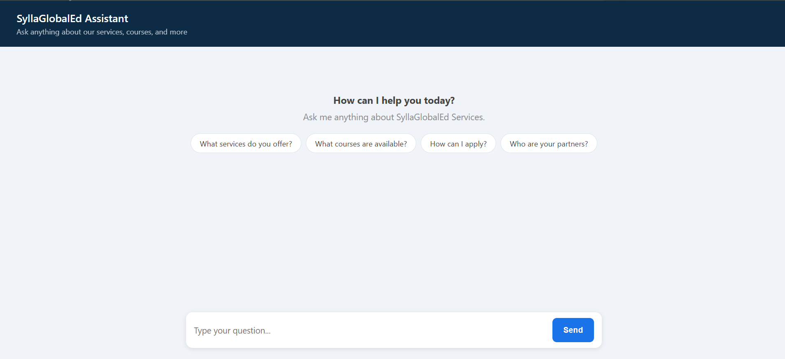
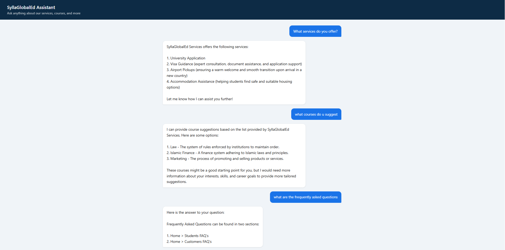

# Website RAG API

A local Retrieval-Augmented Generation (RAG) API that lets users ask natural language questions about any website and get accurate answers — powered entirely by local AI with no API keys required.

Built as a real-world example for [SyllaGlobalEd Services](https://syllaglobaled.com/), an international education consultancy.

---

## Screenshots

### Landing Page


### Conversation


---

## Tech Stack

| Layer | Technology |
|---|---|
| API Framework | FastAPI |
| Vector Database | ChromaDB |
| Embeddings | `all-MiniLM-L6-v2` (via sentence-transformers) |
| LLM | LLaMA 3.2 via Ollama |
| Web Scraping | BeautifulSoup + Requests |
| Frontend | Vanilla HTML/CSS/JS |

> No OpenAI or Anthropic API keys needed. Everything runs locally.

---

## How It Works

```
User Question
     |
     v
FastAPI (/ask)
     |
     v
ChromaDB — finds the most relevant chunks from the site content
     |
     v
Ollama (LLaMA 3.2) — generates an answer using those chunks as context
     |
     v
Answer returned to user
```

---

## Project Structure

```
rag_api/
├── config.example.py   # Copy to config.py and fill in your values
├── scraper.py          # Crawls the target site and saves content to JSON
├── indexer.py          # Chunks content and indexes it into ChromaDB
├── main.py             # FastAPI app — serves the /ask endpoint + frontend
├── static/
│   └── index.html      # Chat UI frontend
├── screenshots/        # UI screenshots for the README
├── requirements.txt    # Python dependencies
└── .gitignore
```

> `config.py`, `scraped_content.json`, and `chroma_db/` are generated locally and never committed to the repo.

---

## Setup & Run

### 1. Install Ollama

Download from [https://ollama.com/download](https://ollama.com/download), then pull the model:

```bash
ollama pull llama3.2
```

### 2. Configure the project

```bash
cp config.example.py config.py
```

Edit `config.py` with your website URL, known pages, site name, and model settings.

### 3. Install Python dependencies

```bash
pip install -r requirements.txt
```

### 4. Scrape the website

```bash
python scraper.py
```

Crawls the site defined in `config.py` and saves all page content to `scraped_content.json`.

### 5. Index into ChromaDB

```bash
python indexer.py
```

Chunks the scraped content and stores it in a local ChromaDB vector database (`./chroma_db`).

### 6. Start the API

```bash
python -m uvicorn main:app --reload
```

### 7. Open the chat UI

Go to [http://localhost:8000](http://localhost:8000) in your browser.

---

## API Reference

### `POST /ask`

**Request:**
```json
{
  "question": "What services do you offer?"
}
```

**Response:**
```json
{
  "answer": "The company offers ...",
  "sources": ["https://example.com/services"]
}
```
